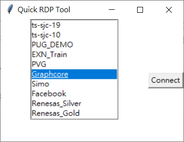
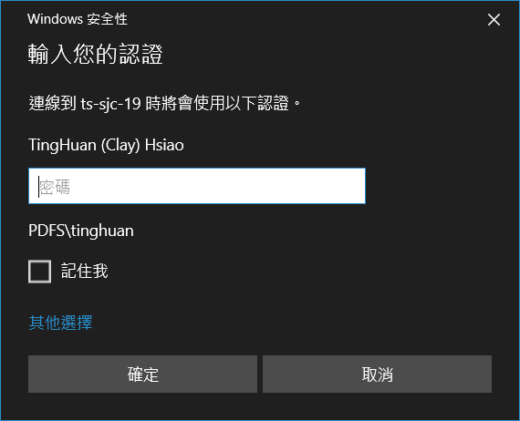
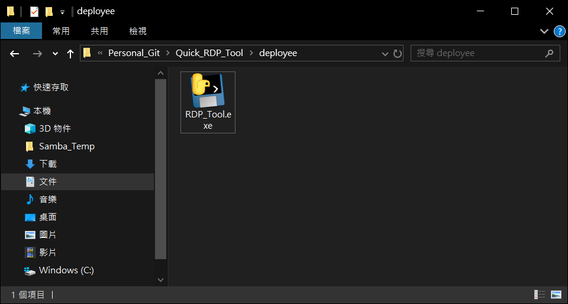
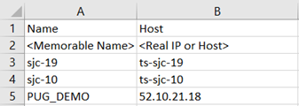

# Quick_RDP_Tool
This repository is use to build a tool which can help me build a RDP connection quickly for different projects

---
## How To Use the application

### Case 1. Execution via Python Script
**Required: Python 3 Installation!**

Step 1: run the python script **`py ./RDP_Tool.py`**

Step 2: When the GUI pop-up, select the project or env in the listbox first and click the Connect button.

Step 3: Input the account/password like what you used to do in the original RDP.

### Case 2. Execution via the exe file
**NOT required to install Python 3** while executing the **RDP_tool.exe** file

Step 1: Execute the exe file **RDP_Tool.exe**

Step 2 & 3: Same as above.

---

## How to modify the item

Check the **cfg/config.csv** file. This file is used to keep the host configuration in a csv file.
**Notice**:
Please keep the file name and path structure as current.
Please keep the header as Name and Host as current.

This file will loaded once when initial the application.
Please restart the application if you did any modification on the config file.

---

## Enhancement in the future?
I don't have plan to enhance the tool at the moment, but list down first as notes.

1. UI Control mechanisam and layout is not well implemented here.
2. The command window is quite bothering.
